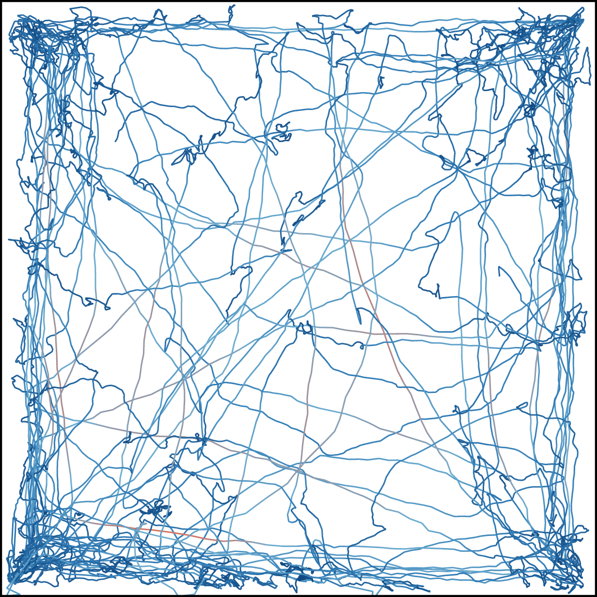
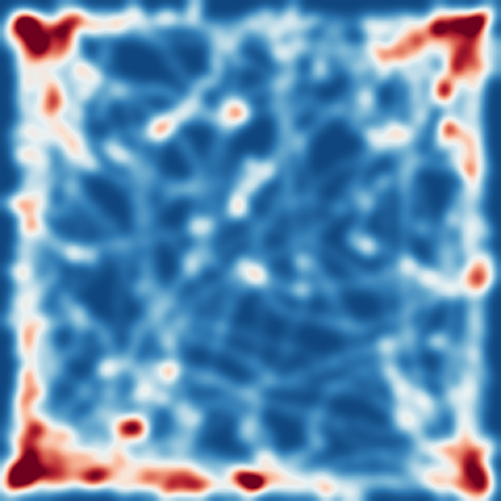
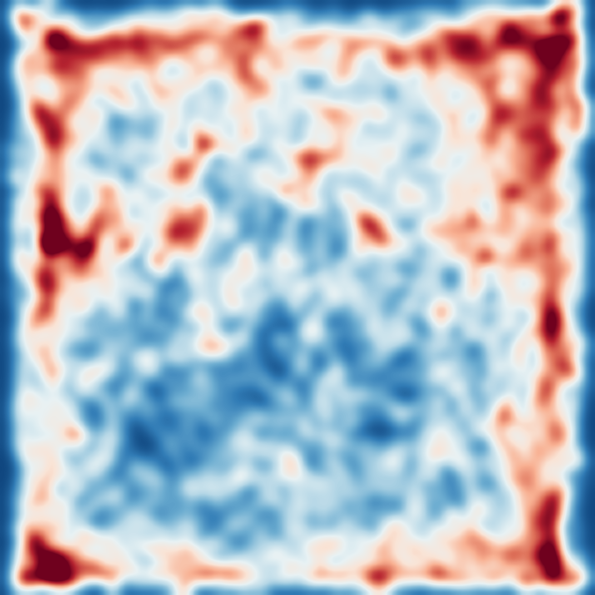

# Open Field Test: DLC Model & Analysis Pipeline & Demo Results
   [](https://doi.org/10.5281/zenodo.17956217)

## 📖 Overview
This repository provides a comprehensive toolkit for **Open Field Test (OFT)** experiments:
1.  **🧠 Pre-trained DLC Model:** A robust DeepLabCut model optimized for tracking mouse/rat body parts in an open field arena.
2.  **📊 Behavior Analysis Pipeline:** A suite of Python scripts to automatically calculate metrics (distance, speed, rotation) and generate visualization plots (trajectories, heatmaps).
3.  **🖼️ Demo Results:** Visual benchmarks demonstrating the pipeline's performance on real experimental data (Normal vs. Model mice).

---


## 🧠 Part 1: DeepLabCut Model

The `DLC model/` folder contains a pre-trained model ready for inference.

**Usage:**
1.  Launch the **DeepLabCut GUI**.
2.  Click **"Load Project"** and select the `config.yaml` file located in the `DLC model/` folder of this repository.
3.  Navigate to the **"Analyze Videos"** tab.
4.  Drag and drop your videos and click **Analyze** to generate tracking data (`.csv` files).

---

## 📊 Part 2: Analysis Pipeline

A 3-step pipeline to turn DeepLabCut `.csv` outputs into metrics and charts.

### 🛠️ Setup
```bash
pip install -r "OFT Behavior Pipeline/requirements.txt"
```

### ⚙️ Configuration
**Before running**, open the `.py` scripts and update the input file paths at the top:
```python
CSV_FILE_PATHS = [
    r"C:\Data\mouse_1_DLC_resnet50.csv",
    r"C:\Data\mouse_2_DLC_resnet50.csv"
]
```

### 🚀 Run Analysis

| Order | Script | Function | Output |
| :--- | :--- | :--- | :--- |
| **1** | `1.analyze_open_field_behavior.py` | **Calculate Metrics** <br> (Distance, Speed, Zone Entries, Rotation) | `open_field_analysis_summary.csv` |
| **2** | `2.plot_trajectories_with_speed.py` | **Visualize Trajectories** <br> (Color-coded by speed) | `trajectory_results/*.pdf` |
| **3** | `3.plot_heatmaps.py` | **Generate Heatmaps** <br> (Spatial density visualization) | `heatmap_results/*.png` |

---

## 🖼️ Part 3: Demo Results

Here is a side-by-side comparison between the **Normal** and **Model** groups.

| | Normal Mouse | Abnormal Mouse |
| :---: | :---: | :---: |
| **Labeled Video** | [🎥 **Click to Watch**<br>(Normal_Mouse.mp4)](Examples/Normal_Mouse_Video.mp4) | [🎥 **Click to Watch**<br>(Model_Mouse.mp4)](Examples/Model_Mouse_Video.mp4) |
| **Trajectory** <br> *(Speed Coded)* |  |  |
| **Heatmap** <br> *(Spatial Density)* |  |  |
